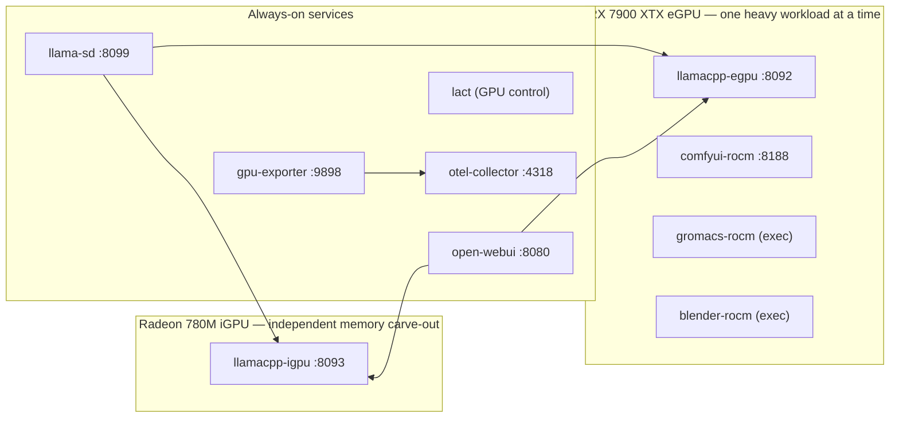

# Spitzenidee's opinionated GenAI stack (for 24 GB VRAM)

This is a (my) containerized stack for local large-language-model inference, image
generation, molecular dynamics, and 3D rendering on a single AMD Radeon RX
7900 XTX eGPU (24 GB GDDR6) paired with a Radeon 780M iGPU. Not at the same time, of course, but one at a time, mediated by `make` targets.

Target host:
- Minisforum UM790 Pro (AMD Ryzen 9 7940HS, 8 cores / 16 threads, Zen 4)
- 64 GB DDR5-5600 system RAM
- AMD Radeon RX 7900 XTX in an OcuLink eGPU dock
- Proxmox VE / Linux VM with VFIO GPU passthrough

The hardware setup is documented in the companion repository
<https://github.com/spitzenidee/um790pro_7900xtx_setup>.

The stack is orchestrated with Docker Compose and a small `make` wrapper.
Because the RX 7900 XTX has no VRAM isolation between compute contexts, only
one GPU-heavy workload runs at a time; switching modes stops the current mode
and starts the target one.

## My "mission statement" and motivation

LLMs and AI in general are tools which are increasingly helpful - and powerful. Once you committed, downsides such as skill atrophy and AI fatigue are bound to set in, making you increasingly reliant, locked-in and dependent on such AI tools. That becomes a real risk if you rent those tools from external providers who...

1. ...own the LLMs, system prompts, SOUL docs etc, and...
2. ...who own the compute, and...
3. ...who own the precision (ie. quantization levels) of LLMs you pay for in the background.

This creates severe vendor lock-in and, in case of a business, strategic dependency. If a provider chooses to cycle LLMs, quant levels etc this may introduce near-undetectable artifacts and service deterioration of processes relying on and modeled after those models. More severe, if a vendor, compute provider or - and we have seen that - state governments decide to pull LLM / AI access for geostrategic reasons (which may, or may not be, justified) and limit access only to hand-selected players, you have an immediate and catastropic service outage and, worst case, loss of revenue while your competitor still enjoys the best SOTA LLM available **to him**. All in all, this may lead to very business-critical life-and-death scenarios (Anthropic Mythos, anyone?).

All in all this culminated in the following realization:

1. I don't own compute, I have to rent it for variable pricing => continuity and budget risk.
2. I don't control the LLM weights, or quantization level => quality / reliability risk.
3. I can't rely on companies, or governments, to ensure service continuity for the previous two points => availability and alignment risk (alignment meaning: I do not control the type of LLM and it's system prompt).

This amounts into a pretty big compound risk. So, with deliberately limited budget I set out to try and control all the above variables to a certain actionable degree:

1. I have compute now in the form of a GPU with 24GB VRAM (plus, in theory, a Mini-PC with 64 GB RAM and an integrated iGPU).
2. I can control and freely choose which LLM to run, and in what quantization, only bound by my hardware limits and software support. I can choose LLMs which have been, to a certain point, community-validated. Plus I fully control the system prompt and harness, if I want to.
3. I do not need to rely on companies for AI services - this is a stretch, because I still rely on sites such as [Huggingface](https://huggingface.co/) to provide repos for huge LLM downloads, and other big players to release their models as open weights in the first place. The time for 100% community-driven open-weight LLMs is not here yet.

I chose a budget limit of 2000€ so "nearly anyone" (yes, I'm aware this is also quite a stretch) could at least try and repeat this or a similar setup. The following prices are partially "old timey" prices, they rose substantially since I bought the first component, a MiniPC, ~2-3 years ago. So, after some research for best ROI I chose this components and went for second-hand where sensible (for deeper details see my [other, more hardware-focused, repo](https://github.com/spitzenidee/um790pro_7900xtx_setup)):

| Component | Price | Year of Purchase | Notes |
|---|---|---|---|
| Minisforum UM790 Pro, 64GB RAM, 1TB SSD | **~800€** | 2023 | |
| Minisforum DEG1 eGPU dock | **~110€** | 2026 | |
| Oculink m.2 adapter | **~20€** | 2026 | |
| AMD Radeon RX 7900 XTX 24GB VRAM | **~650€** | 2026 | bought second-hand locally; chosen simply for the fact that a second-hand NVIDIA RTX 3090 would have cost at least 900€, and both ROCm and Vulkan have matured somewhat in 2025 |
| Power Supply 650W | **~20€** | 2026 | second-hand, bought locally with "*fan makes loud noise, defective*" - changed the fan for a new one, et voilà |
| 2-3 silent fans to help with ventilation | **~50€** | 2026 | |

This gives me a lump sum of my setup of approximately **1650€**, so well within my limit.

## Why GROMACS and BLENDER, then?

Because both benefit vastly from GPU acceleration and I always wanted to test the waters of (algorithmic) 3D rendering and refresh some fun experiments in molecular dynamics simulations, which I worked on during my diploma thesis (see [RuBisCO](https://en.wikipedia.org/wiki/RuBisCO)) and continued for fun during my PhD for a bit.

## Disclaimer

> **This stack, and therefore also this README, have been conceived, implemented and written with significant usage of LLMs (e.g. Github CoPilot).**

> In parts, you can expect the percentage to be 90% implementation by AI, with 90% steering and specification done by a human (me). In other parts, this may change to 100% implementation by AI and only 50% steering by me, because during spec and finetuning with AI I let it loose when I suspected it's intended direction fit my own needs and hardware (e.g. OTel instrumentation via the `llama-sd` component, or `lact`). I let AI write the scaffolding of the README and other docs based on hard factual knowledge extracted from the codebase, let it integrate todos and pointers for me to fill in with my own intentions, information, goals etc, and the result is the README you are currently reading. It's a mixture of purely human-written parts, mixed together with parts written 80-100% by AI.

> Also, this stack and repo are in a state of slow, yet steady, flow - it cannot be considered stable, easy to setup and following a strict release cycle yet (and probably for all eternity). This repo is deliberately experimental and supports my own hardware and use cases as optimal as possible. It is not something that applies on a generalistic scale.

## Use Cases I wanted to try and establish

- llama.cpp / ollama (I chose llama.cpp for size and flexibility)
  - Optimally running on both the eGPU and the iGPU for flexibility and having to agents with considerable context limits in parallel
  - Integration in HomeAssistant
- OpenWebUI as chat interface, mostly for prototyping and testing
- ComfyUI for e.g. stable diffusion
- Blender for 3D rendering
- Gromacs for Molecular Dynamics Simulation
- Monitoring / observability instrumentation via OpenTelemetry, visualization in a (separate) Grafana instance
- Voltage and power control on the eGPU (lact)
- Push power saving limits, especially in idle, to not waste energy, CO2 and my money.
- Run local coding agents (I chose [pi.dev](https://pi.dev/) for now, because it's lean and easy on context)

## Architecture Overview



All GPU access goes through bind-mounted DRI render nodes (`/dev/dri/`); the
containers bring their own ROCm/Vulkan user space, so no ROCm installation is
required on the host.

## Prerequisites

- Docker Engine with the Compose plugin.
- `make` (thin wrapper around `docker compose`; see the `Makefile`).
- Host `amdgpu` kernel driver with both GPUs visible under `/dev/dri/`
  (VFIO passthrough setup is documented in the companion repo linked above).
- Host group IDs for GPU access (`render`, `video`) — see Configuration.

## GPU work modes

The RX 7900 XTX exposes a single VRAM address space to all ROCm/Vulkan
compute clients. Running two heavy GPU workloads simultaneously (likely) causes OOM
and context-switching stalls, so the stack enforces one active GPU mode at a
time.

| Mode      | Active GPU services                              |
|-----------|--------------------------------------------------|
| `llama`   | `llamacpp-egpu`, `open-webui`                    |
| `comfyui` | `comfyui-rocm`                                   |
| `gromacs` | `gromacs-rocm` (interactive, exec in)            |
| `blender` | `blender-rocm` (interactive, exec in)            |

Always-on services (all modes): `lact`, `gpu-exporter`, `otel-collector`, `llama-sd`, `llamacpp-igpu`.

The iGPU service uses the Radeon 780M — separate hardware with its own
system-memory carve-out — so it does not contend for eGPU VRAM and is
exempt from the mode switch: once started, it keeps running in every mode.

```bash
make            # show help + current status
make llama      # switch to Llama/inference mode
make comfyui    # switch to ComfyUI mode
make gromacs    # switch to GROMACS mode
make blender    # switch to Blender mode
make status     # container state table
```

I chose to manage eGPU work modes via this single-switch pattern based on `make` (instead of e.g. setting up separate stack compartments via separate docker-compose files) because I liked the idea to have a single stack, and individual components of this stack are switched on and off via a single entrypoint. At least in my mind this was much more transparent and comprehensible (to my own brain, that is) than any externalization and modularization of the very definition of the stack. So far I can say that it works very reliable and takes care of only stopping and starting the heavy VRAM contender services while leaving all always-on services untouched.

## Services and ports

| Service          | Port | Mode                | Always on |
|------------------|------|---------------------|-----------|
| `llamacpp-egpu`  | 8092 | `llama`             | no        |
| `llamacpp-igpu`  | 8093 | all                 | yes       |
| `open-webui`     | 8080 | `llama`             | no        |
| `comfyui-rocm`   | 8188 | `comfyui`           | no        |
| `gromacs-rocm`   | —    | `gromacs`           | no        |
| `blender-rocm`   | —    | `blender`           | no        |
| `gpu-exporter`   | 9898 | all                 | yes       |
| `llama-sd`       | 8099 | all                 | yes       |
| `otel-collector` | 4318 | all                 | yes       |
| `lact`           | —    | all                 | yes       |

## Quickstart

```bash
git clone <repo>
cd genai_stack
cp .env.example .env
# edit .env to set APP_ROOT and device paths (see Configuration)

docker compose build
make llama

# chat endpoint
curl http://localhost:8092/v1/models

# switch workload
make comfyui
```

My recommendation is to start testing this stack either by Gromacs or Blender (one followed by the other) by firing off both the respective smoketests and stresstests. This is a mostly non-interactive check if the compute of both components **really** takes place on the eGPU. You can monitor the eGPU (and iGPU) load in a parallel shell session via the `gpu-monitor.sh` script. In case this keeps hovering around zero, then for sure something is wrong. In both cases it's expected to exceed 90% GPU load after a short time.

For a more interactive test I recommend the `llama` mode to be activated via `make llama`. This will start both `llamacpp-egpu` and `open-webui` (`llamacpp-igpu` is always-on, in all cases). By then using Open-WebUI via a webbrowser and setting up both eGPU and iGPU llama instances as model provider connections you will be able to interactively test both llama instances with the LLM of your choice (and get some numbers on prompt processing and token generation speeds from Open-WebUI).

## Download a model from Huggingface and move to the model folder

`hf_download.sh` is a small resumable download helper for GGUF weights: it
runs `wget --continue` in the background via `nohup`, so the download
survives closing the SSH session, and interrupted transfers resume where
they left off.

```bash
./hf_download.sh <huggingface_resolve_url> [target_dir]
```

If no target directory is given, files land in `_dl/` (a staging area; the
script writes a `_download.log` and `.pid` file next to each download so
you can monitor with `tail -f` or cancel via `kill $(cat <name>.pid)`).

After the download completes, move the `.gguf` file into
`llamacpp/hfmodels/` — that directory is bind-mounted to `/models` in both
`llamacpp-egpu` and `llamacpp-igpu`, so the weights are visible to both
servers. To actually serve the model, add a `[ModelName]` section for it in
`llamacpp/models-egpu.ini` and/or `llamacpp/models-igpu.ini` (see
Configuration under Inference) and restart the corresponding service. by 
adding a specific LLM to the egpu / igpu `models.ini` variant you can control 
which model is available in which llama.cpp instance. Only LLMs configured in 
either `models-egpu.ini` or `models-igpu.ini` will be available, all others 
will not be exposed.

## Inference: llama.cpp (Vulkan/RADV)

Two `llama-server` instances serve models independently:

| Service          | GPU   | Image build                        | Port |
|------------------|-------|-------------------------------------|------|
| `llamacpp-egpu`  | eGPU  | `llamacpp/Dockerfile.vulkan`        | 8092 |
| `llamacpp-igpu`  | iGPU  | same image, different render node   | 8093 |

### Build (`Dockerfile.vulkan`)

- Multi-stage Ubuntu 24.04 image.
- Builds the latest tagged `llama.cpp` release from GitHub.
- Back end: `GGML_VULKAN=ON` (RADV selects the GPU at runtime via the
  bind-mounted render node; no arch-specific compile needed).
- `GGML_NATIVE=OFF` so the binary is portable across host CPUs.
- Runtime image installs `mesa-vulkan-drivers` and points the loader to
  `/usr/share/vulkan/icd.d/radeon_icd.json`.

Additional build files exist in `llamacpp/` but are not wired into the
active compose profiles:
- `Dockerfile.rocm-builder` — cached ROCm/GGML_HIP build stage;
- `Dockerfile.rocm` — thin runtime wrapper on top of the builder;
- `Dockerfile.cpu` — AVX-512/VNNI-tuned CPU-only build.

**Note:** Similar to the comfyUI CPU-only Docker image I also started out with llama.cpp on the CPU,
then with ROCm on the eGPU, then did a quick benchmark of the ROCm build against Vulkan. I found that 
token generation speeds is ~20% higher for at least small to medium context sizes and decided to stick
with Vulkan, also for the vastly smaller image size. Should I get note on ROCm becoming the better overall
basis for llama.cpp in the future I may switch again (and then have a working ROCm image as a starting point).

### Configuration

Production model-configuration files are created from the tracked example
files in `llamacpp/` and bind-mounted into `/config/models.ini`. The
examples tune KV-cache quantization, context length, speculative decoding,
and reasoning budgets.

Models themselves are stored in the bind-mounted weights directory under
`llamacpp/`.

### Runtime flags

- `--models-preset /config/models.ini` — load configured models.
- `-cb` — continuous batching.
- `-b` / `-ub` — batch / micro-batch sizes.
- `--models-max` — maximum concurrently loaded models.
- `--metrics` — expose Prometheus metrics.

### API

`llama-server` exposes an OpenAI-compatible chat-completions endpoint at
`http://<host>:8092/v1/chat/completions` (and `:8093` for the iGPU).

## Chat frontend: `open-webui`

The `open-webui` service runs the upstream container image and connects to
the eGPU inference backend.

- Port: `8080` on the host → `8080` in the container.
- Depends on `llamacpp-egpu`.
- Pushes OpenTelemetry traces/metrics to `otel-collector:4318`.
- Stores state in a bind-mounted backend data directory.

Started only in `llama` mode.

### Configure iGPU and eGPU endpoints in OpenWebUI

Both llama-server instances (iGPU, eGPU) must be configured as "OpenAI API" endpoints as follows (IP `192.168.1.123` is used an example here, use the IP adress your own VM / machine is running at):

* eGPU
  * `http://192.168.1.123:8092/v1`
* iGPU
  * `http://192.168.1.123:8093/v1`

In the connection config you can add a tag and/or a prefix, which helps dearly with identifying where a model will be served from. E.g. if you assign the prefix `igpu` to the iGPU endpoint, then in e.g. the chat window all models exposed by this endpoint will be available as `igpu.<modelname>`.

## ComfyUI

Two build files exist:

- `Dockerfile.rocm` — active in `comfyui` mode.
- `Dockerfile` — CPU-only PyTorch variant, not wired into the default compose
  profile.

### ROCm image

- Base: `rocm/dev-ubuntu-24.04:7.2.4-complete`.
- PyTorch: nightly ROCm 7.2 wheels (`torch==2.13.0.dev…+rocm7.2`).
- ComfyUI: pinned release tag `v0.28.0`.
- Extra Python deps for ComfyUI-GGUF custom nodes: `gguf>=0.13.0`,
  `sentencepiece`, `protobuf`.

**Note:** I decided to keep the comfyUI docker image, as I started out with testing it on the CPU only and then moved later on to the eGPU. I may remove it later, but for now keep it as a historic reference. It's very slow, though, I recommend to **not** test it out.

### Runtime flags

The compose service overrides the image CMD with performance-oriented flags:

```bash
python3 main.py --listen 0.0.0.0 --port 8188 \
  --use-pytorch-cross-attention \
  --reserve-vram 2 \
  --cache-ram \
  --dont-upcast-attention \
  --async-offload 2 \
  --preview-method latent2rgb
```

Environment:
- `HSA_ENABLE_SDMA=0` — required in this VFIO/KVM passthrough setup to avoid
  IOMMU TLB-flush storms.
- `PYTORCH_CUDA_ALLOC_CONF=garbage_collection_threshold:0.8` — proactive VRAM
  reclaim.
- `LD_PRELOAD=libjemalloc.so.2` — reduces malloc fragmentation.

### Volumes

Models, outputs, inputs, and custom nodes are bind-mounted from the host so
they persist across rebuilds and can be shared with the CPU image. A patched
built-in node module is mounted read-only into the image without shadowing
the rest of the package.

## GROMACS

`gromacs-rocm` is a single-GPU HIP build of GROMACS 2026.3 for RDNA3
(gfx1100).

### Build (`gromacs/Dockerfile.rocm`)

- Base: `rocm/dev-ubuntu-24.04:7.2.4-complete`.
- `ENV ROCM_PATH=/opt/rocm` (the base image does not set it).
- GPU back end: `-DGMX_GPU=HIP -DGMX_HIP_TARGET_ARCH=gfx1100`.
- SIMD: `-DGMX_SIMD=AVX2_256` (auto-detected AVX-512 segfaults on Zen4 in
  this build).
- FFT: GROMACS auto-selects VkFFT for consumer RDNA.
- MPI: off (`-DGMX_MPI=OFF`); uses built-in thread-MPI.
- `LD_PRELOAD=libjemalloc.so.2` and `HSA_ENABLE_SDMA=0`.

### Usage

```bash
make gromacs
docker compose exec gromacs-rocm bash
```

Inside the container:

```bash
gmx mdrun -ntmpi 1 -nb gpu -pme gpu -bonded gpu -update gpu \
  -deffnm run1
```

GPU-resident update requires:
- single rank (`-ntmpi 1`),
- dynamical integrator (`md` or `sd`),
- `constraints = h-bonds` in the `.mdp` (not `all-bonds`).

### Smoketest

Builds a 3 nm water box from built-in force-field files (no network
required), runs energy minimization + a short NVT MD, and verifies the GPU
was used.

```bash
make gromacs
docker compose exec gromacs-rocm bash /work/smoketest.sh
```

The script:
1. writes `topol.top`, `em.mdp`, `nvt.mdp` under `/work/_smoketest`;
2. solvates with `gmx solvate -cs spc216.gro`;
3. runs EM with `-nb gpu`;
4. runs NVT with `-nb gpu -pme gpu -update gpu`;
5. checks `nvt.log` for “Finished mdrun” and GPU-device evidence.

### Stresstest

Downloads one of the MPI-NAT GROMACS benchmark systems and runs it for a
fixed wall-clock budget, reporting `ns/day`.

```bash
docker compose exec gromacs-rocm bash /work/stresstest.sh
```

Available systems:

| System       | Atoms | Constraints | Update step |
|--------------|-------|-------------|-------------|
| `benchMEM`   | ~82 k | all-bonds   | CPU         |
| `benchRIB`   | ~2 M  | all-bonds   | CPU         |
| `benchPEP`   | ~12 M | all-bonds   | CPU         |
| `benchPEP-h` | ~12 M | h-bonds     | GPU-capable |

Default run length is 15 minutes; override with a second argument:

```bash
bash /work/stresstest.sh benchPEP-h 30
```

Only `benchPEP-h` enables `-update gpu`; the other three force the
integrator update onto the CPU because of `all-bonds` constraints.

On my setuP (mind that I lowered the powerlimit for the Radeon RX 7900 XTX to 265W) I get the following numbers for stresstesting on the `benchPEP-h` system (h-bond constraints also on GPU):

```
Step 11900: Run time exceeded 0.247 hours, will terminate the run within 100 steps

| Metric       | Core t (s) | Wall t (s) | (%)   |
|--------------|------------|------------|-------|
| **Time**     | 6339.299   | 905.650    | 700.0 |

| Metric          | ns/day | hour/ns | ms/step | Matom*steps/s |
|-----------------|--------|---------|---------|---------------|
| **Performance** | 2.290  | 10.481  | 75.465  | 165.581       |
```

## Blender

`blender-rocm` runs Blender 5.2.0 LTS headless with Cycles/HIP on the eGPU.

### Build (`blender/Dockerfile.rocm`)

- Base: `rocm/dev-ubuntu-24.04:7.2.4-complete`.
- Downloads the official Blender Linux tarball.
- Installs ROCm runtime libraries and graphics/font/X11 deps required by
  the official binary.
- Sets `HSA_ENABLE_SDMA=0` and `LD_PRELOAD=libjemalloc.so.2`.

### `blender-render` wrapper

`blender/bin/blender-render` is copied into `/usr/local/bin`. It forces:

- background mode (`-b`);
- Cycles engine (`-E CYCLES`);
- GPU compute device (`bpy.context.scene.cycles.device = 'GPU'`);
- HIP back end (`-- --cycles-device HIP`).

This lets you submit `.blend` files saved with a CPU device and still render
on the eGPU.

### File ownership

The service runs as `${UID}:${GID}` (default 1000:1000), so rendered outputs
are owned by the host user.

### Usage

```bash
cp scene.blend ${APP_ROOT}/blender/work/
make blender
docker compose exec blender-rocm blender-render /work/scene.blend \
  -f 1 -o /work/output/frame_ -F PNG
```

One-off project folder override:

```bash
docker compose run --rm \
  -v /path/to/project:/work:rw \
  blender-rocm \
  blender-render /work/scene.blend -f 1 -o /work/output/frame_ -F PNG
```

### Smoketest: BMW27

Download `BMW27_2.blend.zip` from
<https://download.blender.org/demo/test/BMW27_2.blend.zip>, extract it into
`blender/work/_smoketest/` so the scene is at
`blender/work/_smoketest/bmw27/bmw27_gpu.blend`, then run:

```bash
make blender
docker compose exec blender-rocm bash /work/_smoketest/smoketest.sh
```

Expected render time: ~11–13 s for frame 1 on the target hardware.

### Stresstest: Barbershop Interior

Download `barbershop_interior.blend` from the Blender demo files and place
it at `blender/work/_stresstest/barbershop_interior.blend`, then run:

```bash
docker compose exec blender-rocm bash /work/_stresstest/stresstest.sh
```

Expected render time: ~1:40–1:50 min for frame 1 on the target hardware.

## Verifying your setup

| Mode      | Test                       | Command                                                                 | Expected result                        |
|-----------|----------------------------|-------------------------------------------------------------------------|----------------------------------------|
| `llama`   | Inference endpoint         | `curl http://localhost:8092/v1/models`                                  | JSON list of configured models         |
| `comfyui` | Web UI                     | open `http://<host>:8188`                                               | ComfyUI frontend loads                 |
| `gromacs` | Smoketest (water box)      | `docker compose exec gromacs-rocm bash /work/smoketest.sh`              | “Finished mdrun” + GPU-device evidence |
| `gromacs` | Stresstest (MPI-NAT bench) | `docker compose exec gromacs-rocm bash /work/stresstest.sh`             | `ns/day` report after 15 min           |
| `blender` | Smoketest (BMW27)          | `docker compose exec blender-rocm bash /work/_smoketest/smoketest.sh`   | frame 1 in ~11–13 s                    |
| `blender` | Stresstest (Barbershop)    | `docker compose exec blender-rocm bash /work/_stresstest/stresstest.sh` | frame 1 in ~1:40–1:50 min              |

The GROMACS smoketest needs no network; the GROMACS stresstest and both
Blender tests require downloading the assets described in their sections.

## Observability

### `gpu-exporter` (`otel/amdgpu_exporter.py`)

Pure-stdlib Python Prometheus exporter. Reads `/sys/class/drm/card*/device`
and `/sys/class/hwmon/hwmon*`. Exposes GPU busy %, VRAM/GTT bytes,
temperatures, power, clocks, fan RPM, and voltages with `gpu=egpu|igpu`
labels. Port: `9898`.

### `llama-sd` (`otel/llama_sd.py`)

Prometheus HTTP service discovery for `llama-server`. Queries
`/v1/models` on each server and returns only `loaded` models as scrape
targets, preventing idle model loads caused by `/metrics?model=X` requests.
Port: `8099`.

### `otel-collector`

Runs `otel/opentelemetry-collector-contrib:latest` with a bind-mounted
collector configuration file. Receivers cover Prometheus scrape, Docker
container stats, host CPU/memory/load, Docker JSON logs, and OTLP gRPC/HTTP
push from instrumented services.

### Host monitor (`scripts/gpu_monitor.sh`)

Dependency-light bash monitor that reads sysfs directly. Shows both eGPU
and iGPU in a single colorized, low-flicker view.

```bash
scripts/gpu_monitor.sh        # refresh every 2 seconds
scripts/gpu_monitor.sh 1      # refresh every 1 second
```

Requires `bash`, `awk`, `bc`, `cat`, `printf`, `sleep`, `trap`.

### Grafana

`grafana/dashboards/llama-gpu-amdgpu.json` is a dashboard for llama.cpp
inference metrics + AMD GPU hardware + host/container resources. The
provisioning provider in `grafana/provisioning/dashboards/provider.yaml`
shows how to load it into a Grafana instance outside this compose stack.

My own Grafana backend is running inside its own small Proxmox LXC (with docker installed for still-portable setup). You can find an example setup via `docker compose` and config / .env in the `grafana` folder.

## GPU control: LACT

`lact` runs the official `ghcr.io/ilya-zlobintsev/lact:v0.9.0` image in a
privileged container so it can write sysfs for power/voltage/fan control.

- Device nodes for the eGPU are passed through.
- Configuration is bind-mounted from the host and persists across restarts.
- The tracked example file in `lact/` shows settings for `power_cap`,
  `voltage_offset`, `performance_level`, and PMFW fan targets.

`scripts/power_bench.py` uses `docker exec lact lact cli` to sweep the GPU
power limit and record llama.cpp tokens/s to CSV.

The `config.yaml.example` resembles my stable setup. I tested an undervolt of -160mV but am not quite sure that it really is 100% stable, so I settled on -150mV incl power-capping the eGPU at 265W for a better power efficiency sweet-spot (going higher we'll approach diminishing returns quickly).

## Utility scripts

| Script                        | Purpose                                                  |
|-------------------------------|----------------------------------------------------------|
| `scripts/switch-mode.sh`      | Stops non-target GPU modes, starts target mode (invoked by the `make` mode targets). |
| `scripts/gpu_monitor.sh`      | Host sysfs monitor for eGPU + iGPU.                      |
| `scripts/benchmark.sh`        | Builds llama.cpp variants from `bench_configs.ini` and benchmarks tokens/s. |
| `scripts/power_bench.py`      | Sweeps GPU power limit via LACT and records tokens/s.    |
| `hf_download.sh`              | Resumable `wget` download helper for GGUF files.         |

I only use `gpu_monitor.sh` and `hf_download.sh` directly - the gpu-monitor script via a bash alias:

`alias gpumon='/home/<my_user>/docker/genai_stack/scripts/gpu_monitor.sh'`

`switch-mode.sh` is only used via `make` targets, not directly, and both `benchmark.sh` and `power_bench.py` are one-shot benchmark helpers I had created by CoPilot to aide with checking on power-vs-performance sweet spots. I have rarely used them after, but I left them in for reference and in case I might want to pick up further power-finetuning for any reason.

## Configuration

Copy `.env.example` to `.env` and fill in:

- `APP_ROOT` — absolute path to this repository.
- `UID` / `GID` — host user/group IDs (default `1000:1000`).
- `*_PORT` variables — host ports for each service.
- `RENDER_GID` / `VIDEO_GID` — host group IDs for GPU access.
- `GPU_RENDER_DEVICE` / `GPU_CARD_DEVICE` — eGPU DRI nodes.
- `GPU_IGPU_RENDER_DEVICE` / `GPU_IGPU_CARD_DEVICE` — iGPU DRI nodes.
- `GROMACS_PROJECTS_DIR` — parent directory for MD projects.

Discover DRI nodes:

```bash
ls -l /sys/class/drm/
```

## Troubleshooting

- **IOMMU TLB-flush storms (VFIO/KVM passthrough).** All ROCm services set
  `HSA_ENABLE_SDMA=0`; without it, SDMA usage triggers severe TLB-flush
  stalls.
- **GROMACS crashes with AVX-512.** The Zen 4 build pins
  `-DGMX_SIMD=AVX2_256` because auto-detected AVX-512 segfaults in this
  build; do not override without rebuilding and re-verifying.
- **`gmx mdrun -update gpu` is rejected.** GPU-resident update requires a
  single rank (`-ntmpi 1`), an `md`/`sd` integrator, and
  `constraints = h-bonds` (not `all-bonds`) in the `.mdp`.
- **Container cannot see the GPU.** Check the DRI nodes (`ls -l
  /sys/class/drm/`) and that `RENDER_GID`/`VIDEO_GID` in `.env` match the
  group owners of the render nodes.
- **VRAM OOM or context-switch stalls.** Two heavy GPU workloads are
  competing for the eGPU — switch to a single mode with `make <mode>`
  instead of starting services manually.
